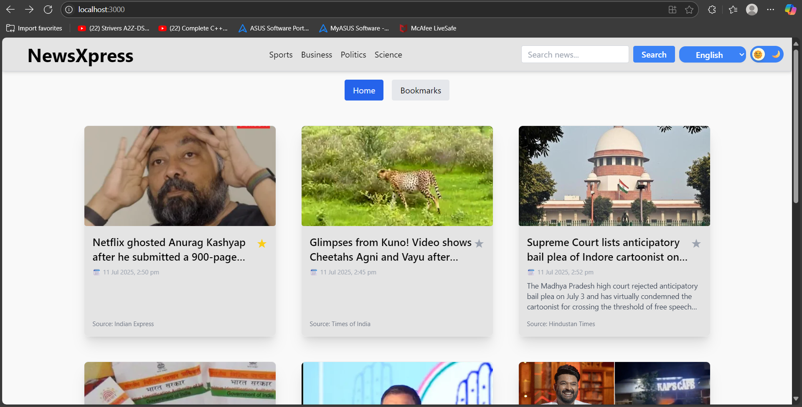
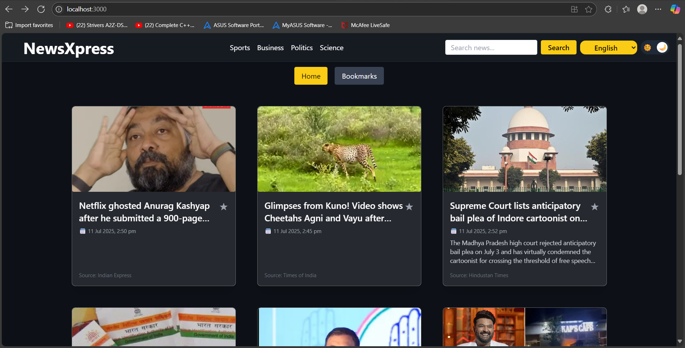
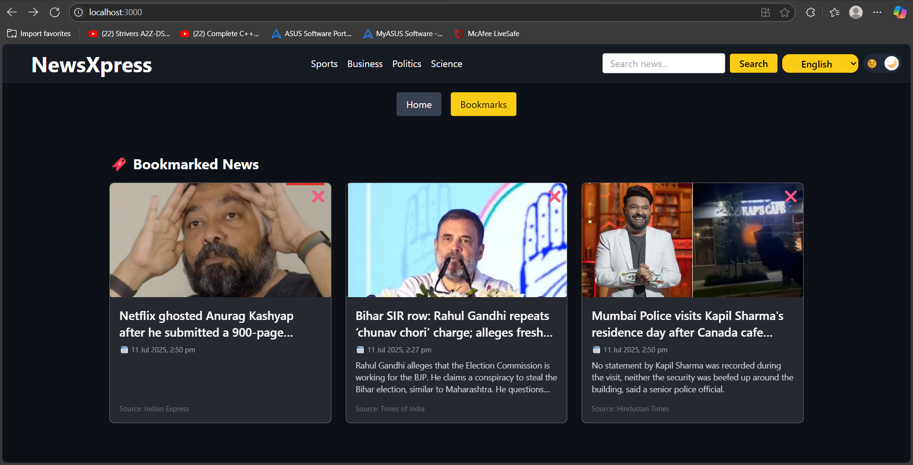

# 🗞️ NewsXpress

**NewsXpress** is a modern, responsive, and customizable news aggregator that delivers trending headlines from around the world in real time. Built with React and powered by the NewsAPI, it features a sleek UI, category filtering, language switching, dark/light mode, and the ability to bookmark articles.

---

## 🚀 Features

* 🔍 Real-time news search
* 🗂️ Category filter (Business, Technology, Sports, etc.)
* 🌐 Multi-language support
* 🌃 Dark and light mode toggle
* 💾 Bookmark and view favorite articles
* 📱 Responsive layout with smooth animations

---

## 🔧 Getting Started (Run Locally)

Follow the steps below to download, set up, and run NewsXpress on your local machine:

### 1. Clone or Download the Repository

Clone the repo:

```bash
git clone https://github.com/Pugaz2006/NewsXpress.git
cd NewsXpress
```

Or download the ZIP file, extract it, and open the folder in a code editor.

---

### 2. Install Node.js (If not installed)

Download and install Node.js from:
👉 [https://nodejs.org/](https://nodejs.org/)

To confirm it's installed, run:

```bash
node -v
npm -v
```

---

### 3. Install Project Dependencies

Inside the project folder, install all required packages:

```bash
npm install
```

This installs everything listed in `package.json`.

---

### 4. Create `.env` File and Add API Key

Create a file named `.env` in the Server directory and add your [NewsAPI](https://newsapi.org/) key:

```env
NEWS_API_KEY=your_newsapi_key_here
```

You can get a free API key by signing up at [https://newsapi.org](https://newsapi.org).

---

### 5. Start the Development Server

Run the app locally:

```bash
npm run dev
```

Then open your browser and go to:
👉 `http://localhost:3000/`

---

## 💠 Tech Stack

* **Frontend**: React, Vite, Tailwind CSS
* **API**: NewsAPI.org
* **State Management**: React Hooks + Context API
* **Storage**: localStorage for bookmarks
* **Optional Backend**: Node.js + Express (for user authentication/bookmark persistence)

---

## 🖼️ Screenshots

| Home Page                       | Dark Mode                       | Bookmarks                               |
| ------------------------------- | ------------------------------- | --------------------------------------- |
|  |  |  |

> Ensure you add the screenshots under a `/screenshots` folder in your project.

---

## ✨ Planned Enhancements

* 🔐 User login/signup with JWT + MongoDB
* 📊 News trend analytics dashboard
* 📱 React Native mobile version
* 🧠 AI-powered news personalization
* 🔔 Push notifications for breaking stories

---

## 🤝 Contributing

Contributions are welcome!
To contribute:

1. Fork the repository
2. Create a new branch (`git checkout -b feature/your-feature`)
3. Commit your changes (`git commit -m "Add your feature"`)
4. Push to the branch (`git push origin feature/your-feature`)
5. Open a Pull Request

For major changes, please open an issue first to discuss what you'd like to change.

---

## 📄 License

This project is licensed under the MIT License.
See the [LICENSE](LICENSE) file for more information.

---

## 📬 Contact

Created with ❤️ by [Pugazheanthi](https://github.com/your-username)
For feedback, questions, or collaboration, open an issue or reach out via GitHub.
